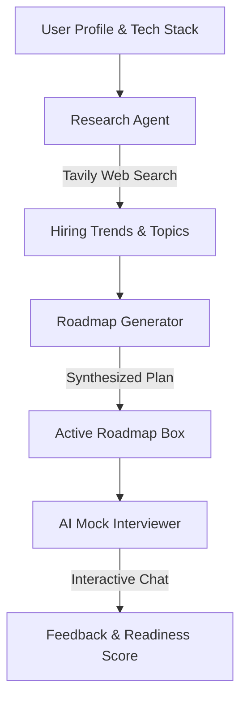

# ⚡ InterviewPilot AI — Premium AI-Powered Technical Interview Mentor

<p align="center">
  
  
  
  
  
</p>

---

## 🎯 Project Vision
**InterviewPilot AI** is a production-grade, AI-driven technical preparation platform designed to operate as a highly personalized, adaptive technical mentor. 

Unlike static question banks, InterviewPilot uses **multi-agent architectures** to research real-time hiring trends, compile bespoke roadmaps, and conduct intelligent mock interviews.

---

## 📸 Key Features
* 🤖 **AI Mock Interviewer** — Simulates HR, behavioral, technical, and system design rounds with a persistent conversational memory.
* 🗺️ **Smart Roadmap Generator** — Dynamically crafts a structured day-by-day plan tailored to target roles, tech stacks, and company patterns.
* 🔍 **Real-Time Market Research** — Scrapes live trends across GitHub, Reddit, Stack Overflow, and engineering blogs using the Tavily Search API.
* 📦 **Zero-Config Box Storage (Hive DB)** — Utilizes a highly efficient, file-based NoSQL JSON box storage model (`./hive_data/`), replacing heavy database servers for seamless local developer setup.
* 🔑 **Rapid Developer Auth** — Features a simplified plain-text credential schema to make local onboarding, testing, and debugging lightning fast.
* 🎨 **Stunning Dark Mode UI** — Designed with a high-end glassmorphism design system using React 19, Tailwind CSS v4, and Framer Motion.

---

## 🏗️ Architecture & Flow

### 1. Multi-Agent AI Pipeline


### 2. Project Directory Structure
```
interview-agent/
├── backend/                  # FastAPI Backend Engine
│   ├── app/
│   │   ├── agents/           # Multi-Agent Architectures (Interviewer, Researcher, Roadmap)
│   │   ├── api/              # RESTful API Endpoints & Auth Handlers
│   │   ├── core/             # Configuration, Security, and Hive DB engine
│   │   ├── models/           # Declarative DB Schema definitions
│   │   ├── schemas/          # Pydantic Schemas for data validation
│   │   └── services/         # Orchestrated Roadmap & Interview business logic
│   ├── hive_data/            # Zero-Config Key-Value Box Storage (.json)
│   └── requirements.txt
├── frontend/                 # Next.js 16 Web Portal
│   ├── src/
│   │   ├── app/              # Dashboard, Onboarding, Authentication pages
│   │   ├── components/       # Shadcn UI Glassmorphism components
│   │   └── lib/              # API and Context states
│   └── package.json
└── PRD.md                    # Core Product Requirements Document
```

---

## 💾 Storage Layer: Local Hive DB
To eliminate the complexity of running local SQLite/PostgreSQL databases during development, we've implemented a **pure Python Hive DB storage engine** located under `./backend/hive_data/`. 

This replicates the "Box" storage paradigm from Flutter/Dart:
* 📂 **`users.json`** — Stores accounts and basic info (plain text for rapid local testing).
* 📂 **`profiles.json`** — Stores onboarded candidate targets, tech stack, and experience.
* 📂 **`roadmaps.json`** — Stores generated preparation curricula.
* 📂 **`interviews.json`** — Stores complete transcript message history, feedback, and mock scores.

All database queries utilize a fully transparent `HiveSession` wrapper over standard SQLAlchemy syntax, maintaining complete ORM flexibility without standard database installation dependencies.

---

## ⚡ Getting Started

### Prerequisites
* **Node.js** >= 20.x
* **Python** >= 3.11.x

### 1. Backend Engine Setup
Navigate to the backend directory, spin up a virtual environment, and install dependencies:
```bash
cd backend
python -m venv venv
# On Windows
venv\Scripts\activate
# On macOS/Linux
source venv/bin/activate

pip install -r requirements.txt
```

Create your configuration environment file:
```bash
cp .env.example .env
```

Configure your API credentials inside `.env`:
```env
OPENAI_API_KEY=your_openai_key
TAVILY_API_KEY=your_tavily_search_key
SECRET_KEY=your_development_jwt_secret
```

Launch the FastAPI dev server:
```bash
uvicorn app.main:app --reload
```
* The API runs locally at `http://localhost:8000`.
* Interactive API Documentation (Swagger) is available at `http://localhost:8000/docs`.

### 2. Frontend Interface Setup
Open a separate terminal window and build the Next.js UI portal:
```bash
cd frontend
npm install
npm run dev
```
* The web application launches at `http://localhost:3000`.

---

## 🤝 Key API Endpoints

| Method | Endpoint | Description |
|---|---|---|
| **POST** | `/api/v1/auth/register` | Registers a new account (stores plain-text key in Hive DB) |
| **POST** | `/api/v1/auth/login` | Logs in and returns a stateless bearer JWT |
| **GET** | `/api/v1/profile` | Fetches active onboarded tech stack and targets |
| **POST** | `/api/v1/roadmaps` | Launches AI agent search and generates a prep roadmap |
| **POST** | `/api/v1/interviews` | Commences a timed mock technical/HR interview |
| **POST** | `/api/v1/interviews/{id}/respond` | Posts student answers and streams real-time agent feedback |

---

## 📝 License
This project is open-source and available under the [MIT License](LICENSE).
